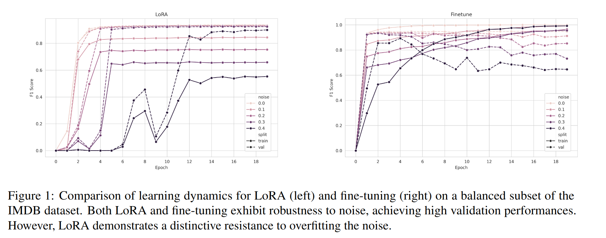

Source code for _**Robustness to Noisy Labels in Parameter Efficient Fine-tuning**_

## Abstract
This study investigates whether LoRA-tuned models  demonstrate the same level of noise resistance observed in fully fine-tuned Transformer models. Our investigation has multiple key findings: First, we show that LoRA exhibits robustness to random noise similar to full fine-tuning on balanced data, but unlike full fine-tuning, LoRA does not overfit the noisy data. Second, we observe that compared to full fine-tuning, LoRA forgets significantly fewer data points as noise increases. Third, studying how these robustness patterns change as training data becomes imbalanced, we observe that Transformers struggle with imbalanced data, with robustness declining as imbalance worsens.

---


---


Provide a brief overview of the project, including its purpose and key features.

## Table of Contents

1. [Setup](#setup)
2. [Replication](#replication)
4. [License](#license)
5. [Acknowledgements](#acknowledgements)

<a name="setup"></a>
## Setup

1. Clone this repository to your local machine:

    ```
    git clone <repository-url>
    ```

2. Navigate to the repository directory:

    ```
    cd <repository-directory>
    ```

3. Install the required dependencies by running:

    ```
    pip install -r requirements.txt
    ```
<a name="replication"></a>
## Replication

### Running Experiments

To replicate the experiments, follow these steps:

1. Ensure you have the necessary environment set up as described above.

2. Open a terminal and navigate to the root directory of the repository.

3. Execute the provided script `run_experiments.sh`:

    ```bash
    cd scripts
    chmod +x acl_exp.sh
    ./acl_exp.sh
    ```

### Understanding the Script

The script `acl_exp.sh` automates the process of running experiments with different configurations. Here's what it does:

- It sets up different parameters such as GPUs to use, datasets, noise ratios, learning rates, etc., for each experiment configuration.

- It iterates through various combinations of parameters and runs the training script `train.py` for each configuration.

- Each experiment is run in a detached screen session, facilitating parallel execution.

### Customization

You can customize the experiments by modifying the script `acl_exp.sh`:

- Adjust the parameters in the script to suit your specific experiment setup.

### Relevant Parameters

Here are the relevant parameters used in the `train.py` script:

- `--TRAIN_BATCH_SIZE`: Training batch size.
- `--VALID_BATCH_SIZE`: Validation batch size.
- `--LEARNING_RATE`: Learning rate.
- `--EPOCHS`: Number of training epochs.
- `--LM`: pretrained language model to use.
- `--method`: Method used for training.
- `--dataset_name`: Dataset for training.
- - `--label_col`: Label column name.
- `--balance`: Create a balanced dataset; default strategy is undersampling.
- `--balance_ratio`: Ratio of positive class in balanced experiments.
- `--warmup_ratio`: Ratio for linear scheduler warmup.
- `--weight_decay`: L2 regularization parameter used as weight decay param in AdamW.
- `--noise_ratio`: Ratio of training samples that will get their labels flipped.
- `--experiment_subdir`: Title of subdir for experiment, all models and logs will be written to this directory.
- `--seed`: Random seed for reproducibility.


### License

This project is licensed under the [MIT License](LICENSE).

## Acknowledgements

....

